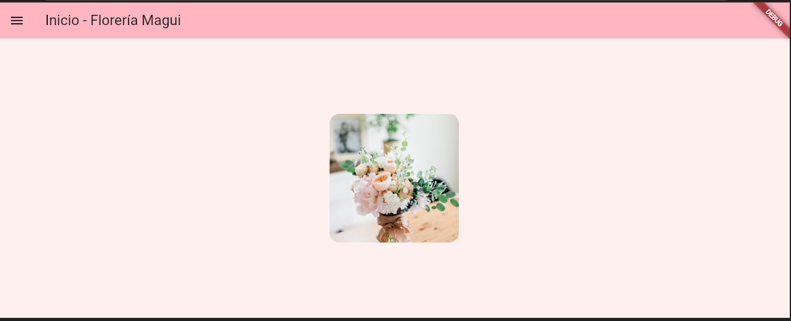
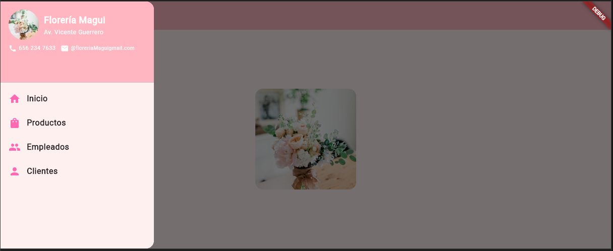
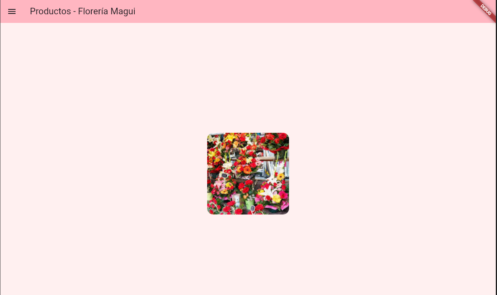
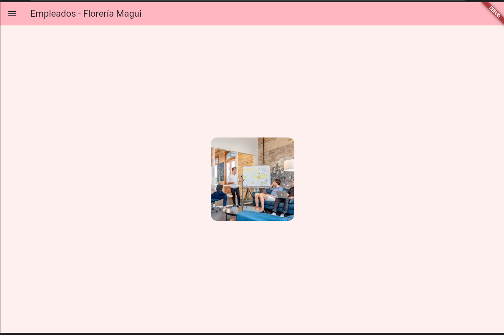
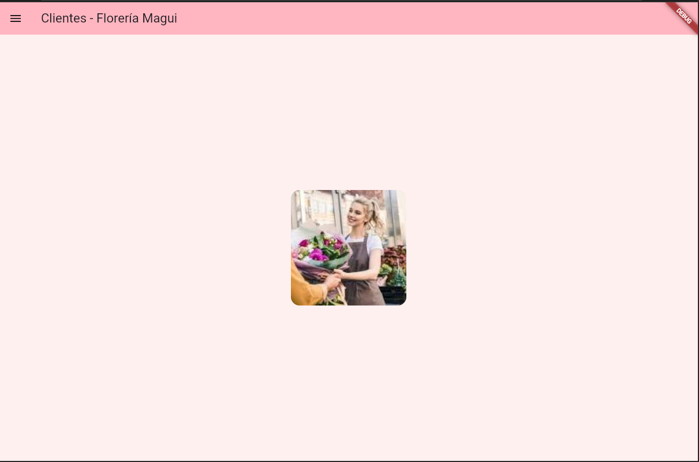
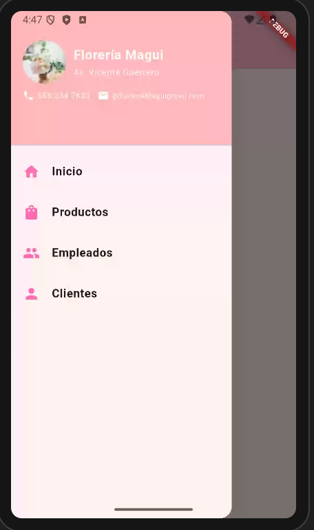
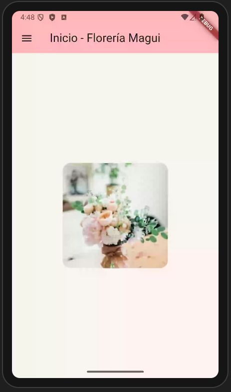
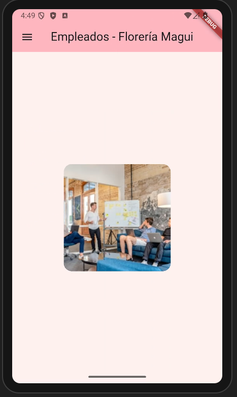

# Florería Magui App

Aplicación móvil desarrollada en Flutter para la Florería Magui.

## Prompt utilizado para generar la app:

"Crea una aplicación Flutter con las siguientes características:
- Drawer con fondo color rosita
- Encabezado del drawer con imagen avatar del negocio de florería desde URL de red
- Nombre de empresa: 'Floreria Magui'
- Dirección: 'Av. Vicente Guerrero'
- Teléfono: '656 234 7633'
- Correo: '@floreriaMaguigmail.com'
- ListTile con icono de flor (reemplazado por iconos Material Design)
- Texto en negrita para las opciones del menú
- Acciones para abrir páginas: productos, empleados, clientes
- Cada página debe tener una imagen centrada de 200x200 desde la red
- Utilizar rutas nombradas para navegación
- Estructura de carpetas: main.dart + carpeta 'LasPaginas' con los archivos de las páginas
- Fondo rosita para todas las pantallas
- Colores en tonos rosados para los AppBar

andoid

